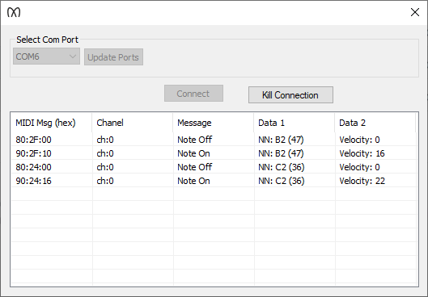

# MIDI Keyboard Sniffer
MIDI Keyboard Sniffer is a software that is using FTDI (a UART TTL to USB converter) to sniff MIDI messages from a MIDI Keyboard

## Introduction
The harware I have used is a USB MIDI Host breakout board from [HobbyTronics](https://www.hobbytronics.co.uk/usb-host-board-v24).

The breakout board is esay to use. Just solder a male header, put it in a bread board, connect the FTDI unit (Power, Ground, Tx, Rx) with male to male hook-up wires.

For the mentioned USB MIDI Host breakout board, use a 3.3V FTDI. The FTDI I'm using is bought from [Digi-Key](https://www.digikey.com/en/products/detail/ftdi-future-technology-devices-international-ltd/TTL-232R-3V3/1836393)

## How to use the code
You need to have Microsoft Visual Studio installed. I'm using VS2019 with c++ and Microsoft Foundation Class (MFC) as option. Yes, I know... MFC is stone age, but it's working and it's a ton of code examples out there...

Download the code and build it. Both x86 and x64 works.

If you just need to have the exe file as is, email me "info at punksynth dot com" and I'll send it to you.

## Usage
When you use the software it looks like this:

The last message enters the top of the listbox.

## Limitations
In this first version (V1.0), I'm sniffing 3 bytes MIDI messages, so I have not yet implemented 1 byte system messages.

## Contributing
Pull requests are welcome. For major changes, please open an issue first
to discuss what you would like to change.

## License
[GPLv3](https://www.gnu.org/licenses/gpl-3.0.en.html)
